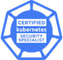

Hi, I am
- an [Antrea](https://github.com/antrea-io/antrea) contributor, mainly for the multicast module.
- I am a Kubernetes enthusiast. I earned three certificates and have experience writing K8s controllers and operators.
- a Cloud native and OSS advocator. 
- a Linux hobbyist. I enjoy setting up my own Linux machines(on routers, Raspberry PIs, laptops, VPS) and hacking with them during my leisure time.

